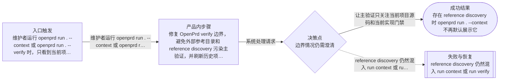

# 流程

## 主流程

- 维护者运行 openprd run . --context 或 openprd run . --verify 时，只看到当前项目主验证状态；仓库中存在 research、toolkit-sources、marketplace-candidates 等参考目录时，默认不会被当成本项目源码说明书缺口直接淹没结果；维护者可以继续按需显式 classify-external。

## Mermaid 流程图

## 边界情况

- 待补充

## 失败模式

- reference discovery 仍然混入 run context 或 run verify
- standards verify 继续被 research 或 toolkit-sources 之类参考目录的说明书缺口淹没
- fleet 更新后历史项目仍保留旧的 verify 噪音行为
