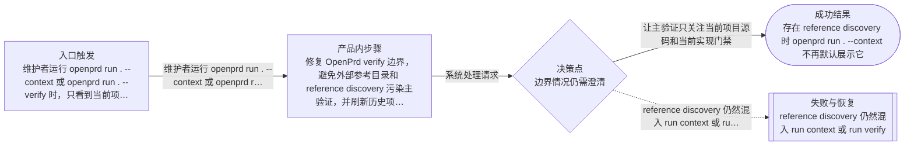
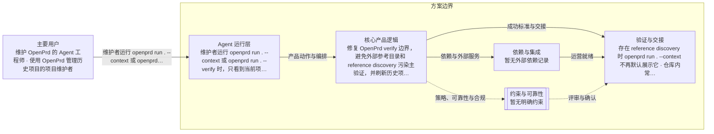

# Verify 边界与历史项目刷新
> 语言规则：除 PRD、OpenPrd、OpenSpec、API、SDK、CLI、TypeScript、JSON、HTTP、WebSocket、字段 key、命令名、产品名和协议名等必要专有名词外，用户可见内容应使用简体中文。
- 版本: v0001
- 负责人: Codex
- 产品类型: agent
- 模板包: agent
- 状态: synthesized
- 生成时间: 2026-05-24 01:56:48
## 元信息

- 标题: Verify 边界与历史项目刷新
- 负责人: Codex
- 状态: classified
- 版本: v0001
- 产品类型: agent
- 日期: 2026-05-24

## 问题

- 问题陈述: 修复 OpenPrd verify 边界，避免外部参考目录和 reference discovery 污染主验证，并刷新历史项目生成物。
- 为什么是现在: 历史项目的 verify 正在被参考目录噪音阻塞，需要尽快恢复 run/verify 的可信度。
- 证据:
  - 待补充

## 用户与相关方

- 主要用户:
  - 维护 OpenPrd 的 Agent 工程师
  - 使用 OpenPrd 管理历史项目的项目维护者
- 次要用户:
  - 待补充
- 相关方:
  - 待补充

## 目标与成功标准

- 目标:
  - 让主验证只关注当前项目源码和当前实现门禁
  - 让历史项目刷新后默认获得更干净的 verify 体验
- 成功指标:
  - 存在 reference discovery 时 openprd run . --context 不再默认展示它
  - 仓库内常见外部参考目录在未人工归类前不再直接把 standards verify 阻塞成大面积说明书噪音
  - openprd fleet 更新后历史项目生成物包含这次修复
- 验收目标:
  - run/verify 的默认结果不再把 reference discovery 或明显外部参考目录当成主门禁噪音
  - 历史项目刷新后生成物能承接这次边界修复
  - 对需要人工确认的 external reference 仍保留显式 classify-external 路径

## 范围与非目标

- 范围内:
  - 调整 run context 与 run verify 对 discovery 的纳入规则
  - 调整 standards/source-manual 默认对明显外部参考目录的处理策略
  - 为历史项目执行 openprd fleet 更新与必要回填
- 范围外:
  - 不自动替每个历史项目猜测所有业务目录的 externalReferences 清单
  - 不修改历史项目的业务代码或需求内容
  - 不把人工确认 external reference 的能力删除

## 场景与流程

- 主流程:
  - 维护者运行 openprd run . --context 或 openprd run . --verify 时，只看到当前项目主验证状态；仓库中存在 research、toolkit-sources、marketplace-candidates 等参考目录时，默认不会被当成本项目源码说明书缺口直接淹没结果；维护者可以继续按需显式 classify-external。
- 边界情况:
  - 待补充
- 失败模式:
  - reference discovery 仍然混入 run context 或 run verify
  - standards verify 继续被 research 或 toolkit-sources 之类参考目录的说明书缺口淹没
  - fleet 更新后历史项目仍保留旧的 verify 噪音行为

## 可视化图表

### 产品流程

### 架构

## 需求

- 功能需求:
  - 待补充
- 非功能需求:
  - 待补充
- 业务规则:
  - 待补充

## 业务护栏

- 成本来源:
  - 待补充
- 额度与限制:
  - 待补充
- 滥用防护:
  - 待补充
- 监控信号:
  - 待补充
- 报警阈值:
  - 待补充
- 止损动作:
  - 待补充

## 约束、依赖与风险

- 技术约束:
  - 待补充
- 合规要求:
  - 待补充
- 依赖:
  - 待补充
- 假设:
  - 待补充
- 风险:
  - 待补充
- 开放问题:
  - 本次只收敛默认边界，不自动猜测每个历史项目全部 external reference 清单；如果某些项目还需要更细的目录级归类，仍由维护者显式确认和补充

## 类型专项模块

- 类型: Agent 专项
- humanAgentContract: Agent 可以识别并提示 reference discovery 与外部参考目录边界，但把目录正式归类为 external reference 仍需要人确认；批量刷新历史项目可以自动执行。
- autonomyBoundary: Agent 可以修改 OpenPrd CLI、补测试、更新文档、运行 fleet dry-run 与 update-openprd/backfill-work-units，并验证结果；不得静默把任意历史目录永久归类为 external reference。
- toolBoundary: 使用本地代码检索、OpenPrd CLI、自带测试、fleet 更新、doctor 与 verify 完成实现和验证；本次不需要外部第三方文档调研。
- stateModel: 需要保留三类状态：当前项目源码验证状态、reference discovery 状态、standards external reference 显式配置；主 run/verify 只默认消费第一类，其他两类按边界显式暴露。
- evalPlan: 通过针对 run-harness、standards 和 fleet 的单测与集成验证评估；再用历史项目 dry-run 与 update-openprd/backfill-work-units 验证刷新结果。

## 交接

- 负责人: Codex
- 下一步: 评审已生成的 PRD，并准备交接。
- 目标系统: OpenSpec
