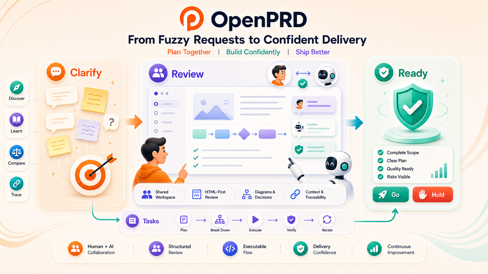
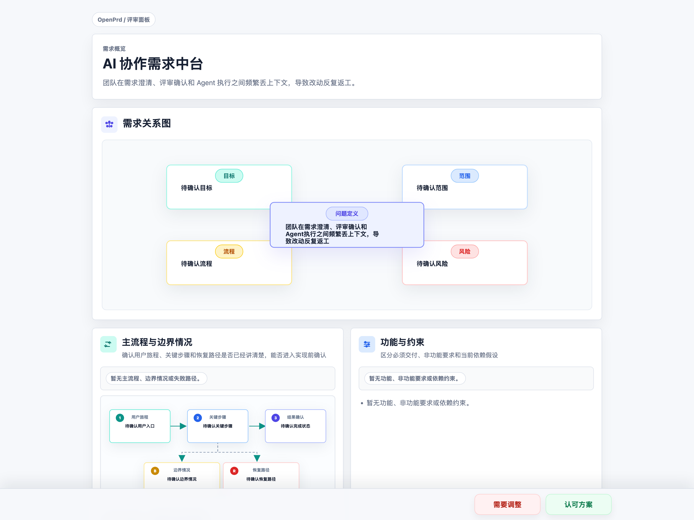
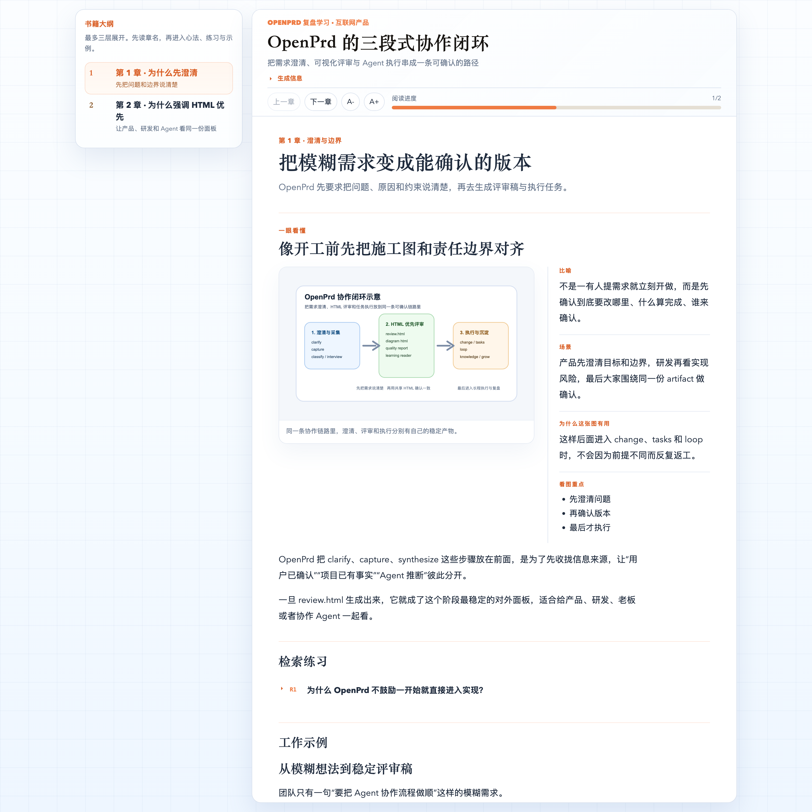
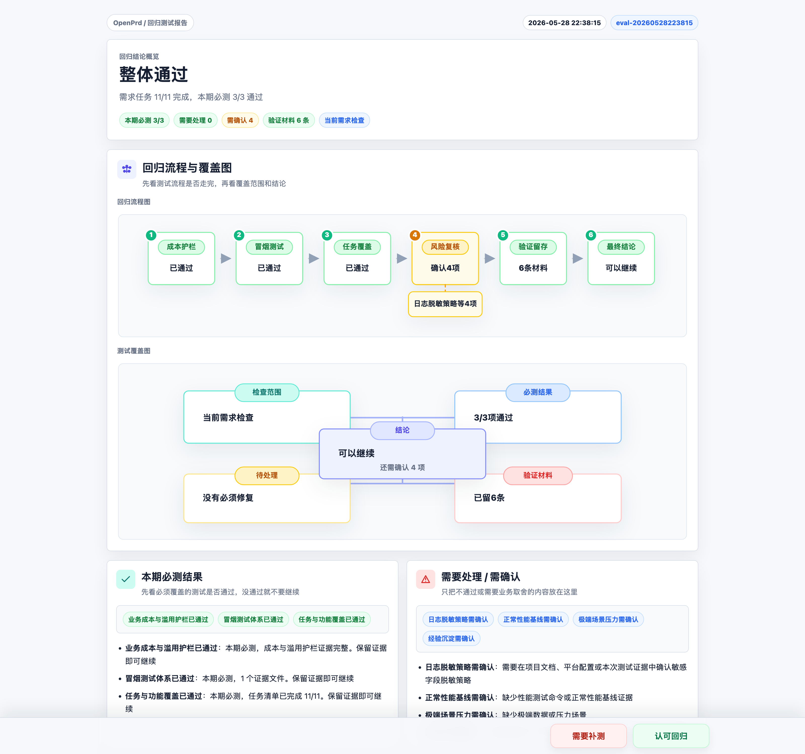
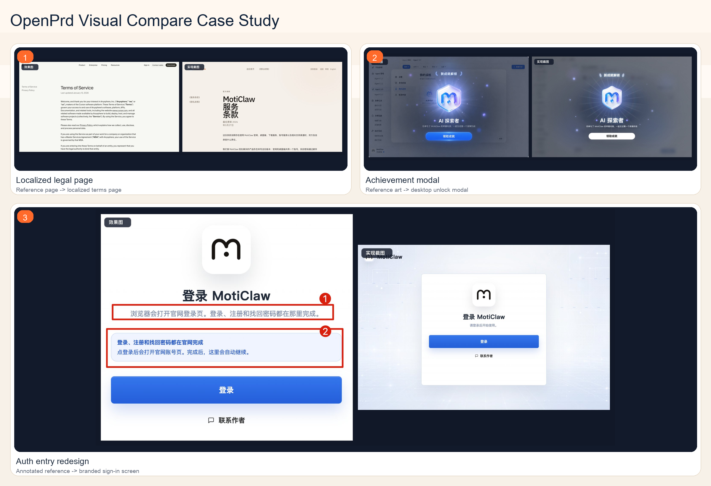

# OpenPrd

[简体中文](./README_CN.md) | English

> AI-native PRD workspace and lifecycle CLI for requirement clarification, HTML-first review surfaces, diagram confirmation, and handoff.

[](./LICENSE)
[](https://nodejs.org/)
[](https://github.com/mileson/openprd)

OpenPrd is a lightweight **PRD harness** for teams and agents that need more than “write a document”. It gives you a local workspace, a clarification-first workflow, policy-based review gates, diagram artifacts, and a structured change/spec/task workflow.

Instead of hiding key decisions in prompts or terminal logs, OpenPrd keeps people and agents aligned around stable HTML artifacts such as `review.html`, learning readers, and quality reports.



## Why OpenPrd

OpenPrd is designed for the gap between:

- vague product ideas that need clarification
- agent-assisted requirement drafting
- human confirmation at the right decision points before implementation
- structured handoff into execution systems

It is especially useful when you want:

- **clarify before drafting** instead of jumping straight to implementation
- **source-aware capture** so user-confirmed facts stay separate from repo-derived, agent-inferred, or agent-normalized context
- **policy-based review gates** that keep stable artifacts without forcing the same stop every time
- **agent-facing skills** shipped with the tool, not hidden in a local environment

## Where OpenPrd Is Different

OpenPrd lives in a different spot than tools that are centered only on spec files
or only on coding execution.

| Tool | Center of gravity | Main user-facing artifacts | Best fit |
|------|-------------------|----------------------------|----------|
| **OpenPrd** | Requirement clarification, HTML-first collaboration, and delivery gates | `review.html`, learning readers, quality reports, diagrams, structured change/task state | Teams that need humans and agents to stay aligned through planning, review, execution, and ship decisions |
| **OpenSpec** | Spec and change lifecycle | Markdown proposals, specs, design docs, tasks | Teams that want disciplined spec deltas and a clean change-management workflow |
| **Superpowers** | Skill-driven coding execution | Skills, plans, worktree/subagent flows, code-review checkpoints | Engineering-heavy teams optimizing how AI agents plan, code, review, and finish branches |

OpenPrd is strongest when the hard part is not just "what code should be written,"
but "what should people confirm, what should stay visible, and what evidence is
enough to move forward."

## Common Real-World Scenarios

Recent Codex project usage kept clustering around the same kinds of work: fuzzy
product requests, existing-product redesigns, release/publish flows, production
incident closure, and reusable learning handoff.

| Scenario | Why OpenPrd stands out here | Main artifacts |
|----------|-----------------------------|----------------|
| Fuzzy product request before anyone codes | Clarify first, separate user-confirmed facts from agent inference, then turn the result into a stable review surface. | `clarify`, `capture`, `synthesize`, `review.html` |
| Existing flow or auth-entry redesign | Reconstruct current behavior from repo and runtime evidence before proposing the next change. | `discovery`, `diagram`, `review.html`, `change` |
| Visual or product-flow confirmation | Keep architecture, product flow, or UI replication reviewable instead of burying decisions in chat. | `diagram`, `visual-compare`, side-by-side JPG reviews |
| Long-running agent implementation chain | Turn accepted work into dependency-ready tasks and run one focused agent session per task with verify gates. | `tasks`, `loop`, prompts, progress logs, verification reports |
| Release, publish, or handoff readiness | Make "ready to ship" a visible decision with standards, regression evidence, abuse/cost guardrails, and workspace health. | `quality`, `run --verify`, `doctor`, `handoff` |
| Learning handoff after a fix or project | Package the final requirement, reasoning, and outcome into something new collaborators can actually study. | learning reader, `.openprd/knowledge/skills/`, docs sync |

## HTML-First Collaboration Surfaces

OpenPrd produces stable, shareable HTML surfaces so product owners, engineers,
and agents can look at the same artifact before work moves forward.

### `review.html`

Use a review-ready PRD surface instead of asking teammates to reconstruct the
latest requirement state from chat history.



### Learning reader

Turn a finished requirement, fix, or workflow into a readable learning package
that new collaborators can study without replaying the whole thread.



### Quality regression report

Summarize readiness, required gates, evidence coverage, and manual decisions in
one human-readable quality surface before handoff, release, or publish.



### Auto-optimized reference-to-screenshot comparison

Put the reference and implementation into one side-by-side artifact for staged
UI review, especially for auth-entry redesign, localized legal pages, and modal
replication work.



## Self-Evolving Collaboration

OpenPrd gets easier to work with over time through two visible loops. One loop
keeps proven team habits as reusable `Project-Level Skill`s. The other keeps
`Dynamic Parameter Config` adaptive, so different project situations start with
different collaboration defaults instead of the same generic checklist.


### Scenario 1: Project-Level Skill

When a team reaches the same conclusion in real work more than once, OpenPrd
can keep that conclusion close to the project instead of leaving it buried in
chat.

- Example: a login-entry redesign confirms that log in, sign up, and password reset should all stay on the official site.
- What gets reused next time: related page checks, release review points, and the preferred path through similar requests.
- Why it matters: the next similar request starts from a shared playbook, and new teammates can follow the same steps without retelling the whole history.

### Scenario 2: Dynamic Parameter Config

Not every project should start the same way. OpenPrd can keep different
collaboration defaults for different situations and bring them back
automatically.

- Example: a greenfield request starts with goal clarification and scope alignment, while an inherited project starts with current-state reconstruction and boundary mapping.
- What changes automatically: what to ask first, what to inspect first, and what proof to gather before handoff.
- Why it matters: teams spend less time re-explaining how this kind of project should run and more time moving with the right setup from the start.

## Features

- **Clarification-first workflow**: `clarify -> capture -> classify -> interview -> synthesize -> diagram -> freeze -> handoff`
- **Scenario-aware collaboration**: distinguish greenfield cold start, existing-project cold start, and continuing workspaces
- **Self-evolving collaboration**: turn confirmed project habits into reusable `Project-Level Skill`s and adapt `Dynamic Parameter Config` by scenario
- **Source-aware capture**: mark inputs as `user-confirmed`, `project-derived`, `agent-inferred`, or `agent-normalized`
- **Diagram review artifacts**: generate both architecture and product-flow diagrams
- **UI visual comparison artifacts**: combine reference images and implementation screenshots into side-by-side JPG reviews for visual replication work
- **Contract-driven diagrams**: render from validated JSON contracts
- **Review status tracking**: use `pending-confirmation`, `confirmed`, and `needs-revision`
- **OpenPrd discovery mode**: initialize durable coverage runs for existing projects, reference projects, or unclear requirements
- **Project standards**: initialize and verify `docs/basic/`, file manual templates, and folder README templates as part of execution quality gates
- **Quality Regression Reports**: review overall regression status, per-requirement module status, test-block results, observability, business cost and abuse guardrails, smoke coverage, performance baselines, and project knowledge through HTML reports
- **Project knowledge skills**: turn verified fixes and recurring diagnosis patterns into reusable `.openprd/knowledge/skills/` experience skills
- **OpenPrd change and task execution**: materialize PRD snapshots into change files, validate them, apply accepted specs, archive changes, and advance structured tasks by dependency order
- **Long-running agent loop**: turn accepted change tasks into one-task-per-session Codex or Claude execution prompts with verification, progress logs, and optional task commits
- **Default agent integration**: generate Codex, Claude, and Cursor guidance from one OpenPrd source, including Codex hooks with `codex_hooks = true`
- **Agent harness skills**: repo-local skills for shared rules, workflow control, and diagram review

## Tech Stack

| Layer | Technology |
|-------|------------|
| Runtime | Node.js 20+ |
| CLI | Native Node ESM |
| Config / state | JSON + YAML |
| Diagram renderer | Self-contained HTML + inline SVG |
| Image processing | `sharp` for JPG / PNG / WebP visual comparison artifacts |
| Testing | `node --test` |
| Agent guidance | Repo-local `skills/` + `AGENTS.md` + Codex / Claude / Cursor generated adapters |

## One-line Install

Install directly from GitHub:

```bash
npm install -g git+https://github.com/mileson/openprd.git
```

Then verify:

```bash
openprd --help
```

## Quick Start

### 1. Initialize a workspace

```bash
openprd init /path/to/project --template-pack agent
```

`init` creates `.openprd/`, `docs/basic/`, `AGENTS.md`, and generated Codex / Claude / Cursor guidance. Codex projects also get `.codex/config.toml`, `.codex/hooks.json`, `.codex/hooks/openprd-hook.mjs`, and user-level Codex `codex_hooks = true`.

Codex hooks default to `lite`: `UserPromptSubmit`, a lightweight `PreToolUse`
write gate, and a lightweight `Stop` end-of-turn review. Context is injected for prompts that explicitly mention OpenPrd,
PRD, deep research/benchmarking, replication, standards, fleet, documentation
standards, or look like new product/module/workflow requirements. The lite write
gate only matches direct editing tools so read-only shell exploration stays
quiet, while `Stop` reviews whether the current turn produced a reusable project
pattern; use `guarded` when shell commands should also pass through the write gate,
and `full` only for temporary deep diagnostics.
Concrete bugfix prompts with diagnostic evidence such as errors, logs, repro
steps, or root-cause investigation skip requirement intake when the user asks to
fix directly; confirmation wording also accepts phrases like "confirm the fix".

### 2. Check the current collaboration state

```bash
openprd status /path/to/project
openprd next /path/to/project
```

### 3. Clarify with the user

```bash
openprd clarify /path/to/project
```

Clarification stays in the conversation as an inline outline or short checklist. The formal HTML review surface is `review.html` after synthesis.

### 4. Capture answers back into the workspace

Single field:

```bash
openprd capture /path/to/project \
  --field problem.problemStatement \
  --value "Mobile users cannot efficiently manage agent sessions on the go" \
  --source user-confirmed
```

Batch capture:

```bash
openprd capture /path/to/project --json-file answers.json
```

If `openprd synthesize` reports that the generated `spec.md` would still fail the
Simplified Chinese preflight, normalize the wording with
`--source agent-normalized` before recording the current `review.html` artifact.

### 5. Draft and review

```bash
openprd synthesize /path/to/project \
  --title "Moticlaw Mobile" \
  --owner "Moticlaw" \
  --problem "Mobile users lack a direct-first client for node selection and agent interaction." \
  --why-now "The control plane already exists and the missing piece is a mobile entry point."

openprd diagram /path/to/project --type architecture --open
openprd diagram /path/to/project --type product-flow --open
openprd review /path/to/project --open
openprd review /path/to/project --mark confirmed --version <id> --digest <sha256> --work-unit <id>
```

`review.html` is the stable review artifact for the current PRD, but the default
approval policy is `decision-points`, not “always stop here”. In a normal lane,
the user reviews that stable artifact first and then the exact copied
`--version`, `--digest`, and `--work-unit` tuple is recorded. In a
`silent-record` lane, OpenPrd can record the exact current artifact without an
extra stop only when the user already made direct execution intent explicit and
explicitly opted out of additional review confirmation. Do not treat
implementation approval as permission to mark a different review artifact, and
do not treat review recording as execution authorization. After the current
artifact is recorded, generate the OpenPrd change and task breakdown. If the
user originally asked to implement, execution can continue once tasks are ready;
otherwise wait for an explicit execution request:

```bash
openprd change /path/to/project --generate --change <change-id>
openprd tasks /path/to/project --change <change-id>
```

### 6. Freeze and handoff

```bash
openprd freeze /path/to/project
openprd handoff /path/to/project --target openprd
```

### 7. Start OpenPrd discovery mode

Users can ask in natural language:

```text
Use OpenPrd to deeply complete this project.
Use OpenPrd to comprehensively mine this reference project into the new project.
Keep digging into this requirement until OpenPrd coverage is complete.
```

Discovery and loop execution require explicit depth or execution intent. For
planning, architecture review, impact analysis, or "which files would change?"
questions, agents should inspect state and answer read-only instead of advancing
coverage or launching loop tasks.

Agents route those requests internally. The underlying command is:

```bash
openprd discovery /path/to/project --mode brownfield
openprd discovery /path/to/project --resume
openprd discovery /path/to/project --advance --claim "Users can start a session from the dashboard" --evidence src/app.ts
openprd discovery /path/to/project --verify
openprd change /path/to/project --generate --change <change-id>
openprd change /path/to/project --validate --change <change-id>
openprd standards /path/to/project --verify
openprd tasks /path/to/project --change <change-id>
openprd tasks /path/to/project --change <change-id> --advance --verify --item T001.01
openprd change /path/to/project --apply --change <change-id>
openprd change /path/to/project --archive --change <change-id>
openprd specs /path/to/project
openprd changes /path/to/project
```

Discovery verification also checks the active OpenPrd change structure, spec deltas,
`docs/basic/` standards, and long-running task files. Keep `tasks.md` as the first
entry, cap each task file at 25 substantive checkbox tasks, and continue with
`tasks-002.md`, `tasks-003.md`, etc. The final checkbox in every non-final file
should hand off to the next file so agents can resume in order. A project can use
a stricter local cap with `.openprd/discovery/config.json` at
`taskSharding.maxItemsPerFile`.

That 25-item limit is only a sharding cap, not a decomposition target. Prefer task
titles that describe concrete implementation units, wiring boundaries, entry
surfaces, integration closures, and regression passes instead of mirroring PRD
section labels like "primary flow", "requirement", or "acceptance goal".

When a task needs a stable id for long-running execution, keep the metadata small:

```md
- [ ] T009.07 Port legacy database import preview
  - type: implementation
  - deps: T001.14, T007.06
  - done: preview shows counts, conflicts, skipped items, warnings
  - verify: npm run test -- migration
  - oracle: compare sample import output against the legacy preview and record mismatches
```

Use `type` to distinguish `implementation`, `verification`, `documentation`, and
`governance` work. `deps` is only needed when the task depends on earlier task ids.
`done` is the completion condition, and `verify` is the command or review step
that proves it. For `implementation`, `verification`, and `documentation` tasks,
`verify` must exercise the real work, such as `openprd run . --verify`, test
commands, or an explicit manual review step; do not use `openprd change . --validate`
as the only proof. Use `oracle` when the task must compare against a reference
implementation, golden data set, screenshot baseline, or other explicit source
of truth; `openprd loop --finish` then requires `--notes` or `--evidence` so the
comparison result is recorded.

`tasks` lists the next dependency-ready task by default. `--advance` marks
one task complete, and `--verify` runs that task's `verify` command before marking
it complete. Execution events are stored outside the task files so the task metadata
stays small.

## Project Standards

`openprd init` creates a project standards contract:

- `docs/basic/file-structure.md`
- `docs/basic/app-flow.md`
- `docs/basic/prd.md`
- `docs/basic/frontend-guidelines.md`
- `docs/basic/backend-structure.md`
- `docs/basic/tech-stack.md`
- `.openprd/standards/file-manual-template.md`
- `.openprd/standards/folder-readme-template.md`

Use:

```bash
openprd standards /path/to/project --verify
```

OpenPrd generated changes include standards maintenance tasks, and change validation
checks the standards contract. The canonical project docs path is only
`docs/basic/`.

During implementation, standards maintenance is an explicit impact check, not a
best-effort cleanup. For every added or modified source file, agents should check
whether `docs/basic/`, the file manual, or the containing folder README is missing
or stale. Missing docs must be created; existing docs should be updated whenever
the change affects responsibilities, flows, structure, dependencies, or product
behavior. If no documentation update is needed, agents should say the check was
performed and why the existing docs still match the code.

## Auto-optimized reference-to-screenshot comparison

When UI work already has a reference effect image, design image, user-provided
screenshot, or agent-generated mock, the agent should capture the implemented
UI and generate a side-by-side review image before claiming visual completion:

```bash
openprd visual-compare /path/to/project \
  --reference effect-image.png \
  --actual implementation-screenshot.jpg
```

The default output is a compact JPG under
`.openprd/harness/visual-reviews/`. The left panel is labeled `效果图`; the
right panel is labeled `实现截图`. Inputs can be common image formats supported
by `sharp`. The output can be adjusted when needed:

```bash
openprd visual-compare /path/to/project \
  --reference effect-image.png \
  --actual implementation-screenshot.jpg \
  --out review.webp \
  --format webp \
  --quality 82 \
  --max-panel-width 1180
```

Agents should inspect the generated image and keep iterating until there are no
obvious visual differences. The final response for reference-driven UI work
should include the generated review image path and note whether differences
remain.

When UI work has no reference image, capture the current interface first,
implement the change, capture the same entry, viewport, account, and data state
again, then generate a before/after self-check:

```bash
openprd visual-compare /path/to/project \
  --before before-screenshot.png \
  --after after-screenshot.jpg
```

The output uses `修改前` / `修改后` labels and a
`visual-before-after-*.jpg` filename. Agents should inspect it for the intended
change and for unexpected drift in unchanged regions. Large directional UI
redesigns still need a design review before implementation; before/after is for
checking changes to an existing interface.

## Quality Regression Reports

`openprd init` also creates a quality contract:

- `.openprd/quality/config.json`
- `.openprd/quality/reports/`
- `.openprd/knowledge/`

Use:

```bash
openprd quality /path/to/project --verify
```

The command writes both JSON and HTML reports under `.openprd/quality/reports/`.
The HTML regression report is the human-readable quality surface: overall
regression status, per-requirement module status, test-block pass/fail results,
missing items, and the small set of gaps that need a person to decide whether
they are in scope for the current delivery. EVO is OpenPrd's internal shorthand
for the evaluation/verification quality layer; the visible report does not ask
users to know that acronym. A script or fixture being present only proves
capability; required gates need current evidence or an explicit waiver.

When a requirement involves free users, quotas, AI calls, third-party APIs,
generation, storage, downloads, or other metered costs, `quality --verify`
also checks for cost drivers, user-level limits, negative abuse-path
verification, usage/cost monitoring, alert thresholds, and stop-loss actions.

`openprd quality --verify` is blocking by default when required test blocks are
not production-ready. `openprd run --verify` repeats that quality gate so final
readiness cannot ignore the report. Agents should not claim readiness until
every required test block is either passing with evidence or explicitly out of
scope for the scenario.

For UI work with an existing reference image, visual readiness also requires a
current `openprd visual-compare` artifact under `.openprd/harness/visual-reviews/`.
If the combined image still shows obvious differences, the task should return to
implementation instead of treating the gap as ready.

After a fix has been verified and reviewed, promote the abstract pattern into
project knowledge:

```bash
openprd quality /path/to/project --learn --review --from .openprd/harness/turn-state.json
openprd quality /path/to/project --learn --from <report-id-or-json>
openprd quality /path/to/project --learn --from ./diagnostics/incident-2026-05-24
```

`--learn --review` first writes a pending knowledge candidate under
`.openprd/knowledge/candidates/` plus a draft skill under
`.openprd/knowledge/drafts/`. Once the draft is worth keeping, `--learn --from`
promotes it into incident, pattern, and experience skill artifacts under
`.openprd/knowledge/` so future tasks can retrieve the lesson instead of
rediscovering it. `--from` now accepts either a quality report JSON or an
extracted diagnostics directory / evidence file that already contains
`diagnostic-report`, `runtime-events`, `timeline`, or `root-cause-candidates`
artifacts, so a verified fix can be promoted directly into a reusable
troubleshooting skill.

## Agent Setup

OpenPrd can install the project harness into the agent environment so users do not
need to remember which skill, command, or hook to invoke:

```bash
openprd setup /path/to/project
openprd doctor /path/to/project
openprd update /path/to/project
openprd update /path/to/project --hook-profile lite
openprd fleet /path/to/projects --dry-run
openprd fleet /path/to/projects --sync-registry
openprd fleet /path/to/projects --backfill-work-units
openprd run /path/to/project --context
openprd run /path/to/project --verify
openprd loop /path/to/project --plan --change <change-id>
openprd loop /path/to/project --run --agent codex --dry-run
```

Installing the CLI alone does not mutate a project or user config. The full
Codex/Claude/Cursor adapter set is installed when the user runs `openprd init`
or `openprd setup` inside a project.

`setup` and `init` generate:

- `AGENTS.md` managed OpenPrd rules
- `.codex/skills/`, `.codex/prompts/`, `.codex/config.toml`, `.codex/hooks.json`, and `.codex/hooks/openprd-hook.mjs`
- user-level Codex config with `features.codex_hooks = true`
- `.claude/skills/`, `.claude/commands/openprd/`, and `CLAUDE.md`
- `.cursor/rules/openprd.mdc` and `.cursor/commands/`
- `.openprd/harness/install-manifest.json`, `hook-state.json`, `events.jsonl`, `drift-report.json`, and `visual-reviews/`

`doctor` verifies that the generated rules, Codex hooks feature flag, standards,
and workspace validation are healthy. `update` refreshes the generated adapter
files from the canonical OpenPrd source while preserving unrelated user hook
groups.

The harness is stateful, but hooks are proportional to the chosen profile.
Default `lite` keeps a lightweight `PreToolUse` write gate for requirement
intake and limits it to direct editing tools, while `Stop` performs a lightweight
end-of-turn knowledge review instead of full telemetry. This avoids read-only shell hook
noise while still nudging the agent to capture reusable project patterns. `guarded` also gates shell tools, while
`full` restores SessionStart/PreToolUse/PostToolUse/Stop telemetry for temporary
diagnostics. High-risk actions such as freeze, handoff, accepted spec
apply/archive, commit, push, release, or publish are gated by
`openprd run . --verify`, which covers standards, workspace validation, active
change validation, and active discovery verification.

`openprd run . --context` is the Ralph-style loop surface for agents. It selects
the next executable unit from active change tasks, discovery coverage, or normal
OpenPrd workflow state, and records hook turns in `.openprd/harness/iterations.jsonl`.

### Long-Running Agent Loop

For implementation work that should behave like the harness pattern described by
Anthropic's long-running agent guidance, use `openprd loop`. The loop is stricter
than `run --context`: it creates a durable feature list, writes a single-task
prompt, starts a fresh Codex or Claude session for exactly one task, verifies the
task, and can commit that task before moving on.

For reference-driven UI tasks, the loop prompt and generated guidance require the
agent to capture an implementation screenshot, run `openprd visual-compare`, and
review the side-by-side JPG before finishing the task.

`openprd run --context` may surface loop commands as execution commands, but they
are not automatic instructions. Agents should run `openprd loop --run`,
`openprd tasks --advance`, `openprd discovery --advance`, or commit commands only
when the current user message explicitly asks for development, implementation,
task continuation, deep research/benchmarking, replication, or commit. Read-only
planning and review turns should stop at the module/file plan.

Loop is recommended from the substantive implementation task count, not from every
checkbox. When a change has 10 or more pending/total `implementation` tasks,
`run --context` recommends an isolated worktree or equivalent environment plus a
single-task Loop session.

```bash
openprd loop . --init
openprd loop . --plan --change <change-id>
openprd loop . --next
openprd loop . --prompt --agent codex
openprd loop . --run --agent codex --dry-run
openprd loop . --run --agent claude --dry-run
openprd loop . --verify --item T001.01
openprd loop . --finish --item T001.01 --commit --message "Complete T001.01"
```

The loop writes its durable state under `.openprd/harness/`:

- `feature-list.json` is the ordered implementation task list.
- Each loop task carries a human-readable `taskHandle` such as
  `change-id:T001.01:task-title`, so another conversation can continue the same
  task without relying on a chat-specific UUID.
- `progress.md` is the human-readable progress log.
- `failed-approaches.md` is the dead-end ledger for mismatches, rejected fixes,
  and why they failed, so the next session does not retry the same path.
- `agent-sessions.jsonl` records each prompt/run/finish event, including the
  task handle and task title for cross-session lookup.
- `bootstrap.sh` is the startup check each fresh agent session runs.
- `loop-state.json` stores the current task id, task handle, task title, and
  the last agent session metadata.
- `loop-prompts/` stores generated single-task prompts for audit and reuse.

Use `--dry-run` first when you want OpenPrd to prepare the prompt and exact command
without launching an agent. Use `--agent codex` or `--agent claude` for the default
CLI integrations. Use `--agent-command "<custom command>"` only when you want to
pipe the OpenPrd prompt into a project-specific wrapper.

For historical projects, use `fleet` instead of hand-writing shell loops. By
default it scans and reports only, while also telling you how many known
OpenPrd workspaces already exist in the global registry and how many are outside
the current root. `--sync-registry` backfills initialized `.openprd/`
workspaces into `~/.openprd/registry/workspaces.jsonl`. `--update-openprd`
refreshes projects that already contain `.openprd/` and also backfills
historical PRD work unit bindings. Project standards or validation gaps are
reported as health items, but they do not block generated guidance updates. Use
`--backfill-work-units` when you only want to refresh versioned review artifacts
and identity bindings, while agent-only or plain projects stay untouched unless
explicitly selected with `--setup-missing`.

## How to Read `status` and `next`

OpenPrd is not just a command runner. It exposes collaboration state.

### `openprd status`

Use it to understand:

- current scenario
- user participation mode
- current gate
- upcoming gate

Example signals:

- `Scenario: Cold start (existing project)`
- `User participation mode: context-plus-confirmation`
- `Current gate: clarify-user`
- `Upcoming gate: architecture diagram review`

### `openprd next`

Use it to understand:

- what should happen next
- why that step is recommended
- which questions should be asked now

## Diagram Contracts

OpenPrd supports:

- `architecture`
- `product-flow`

You can let the tool infer a draft from the current workspace, or supply an explicit contract:

```bash
openprd diagram /path/to/project \
  --type product-flow \
  --input ./product-flow-contract.json
```

The diagram contract is validated against built-in schema files in `.openprd/schema/`.

## Agent Skills

This repository ships a repo-local `skills/` directory modeled after the `lark-shared + domain skills` pattern used by `larksuite/cli`.

- `skills/openprd-shared/` — shared guardrails and language/review rules
- `skills/openprd-harness/` — main OpenPrd workflow sequencing
- `skills/openprd-standards/` — project docs, file manual, and folder README standards
- `skills/openprd-diagram-review/` — diagram generation and review loop guidance
- `skills/openprd-discovery-loop/` — sustained OpenPrd coverage discovery

Agents entering this repository should read:

- `AGENTS.md`

## Project Structure

```text
.
├── AGENTS.md
├── bin/
├── src/
├── skills/
├── test/
├── docs/
│   └── basic/
├── openprd/
│   ├── changes/
│   ├── specs/
│   └── archive/
└── .openprd/
    ├── schema/
    ├── templates/
    ├── engagements/
    ├── state/
    └── exports/
```

Key directories:

- `src/` — CLI logic, PRD core, diagram rendering
- `docs/basic/` — project-level baseline docs maintained by OpenPrd standards
- `skills/` — repo-local agent skill system
- `.openprd/` — shipped workspace seed
- `test/` — regression coverage for clarify / capture / diagram / gate logic

## Agent Prompt Examples

You can steer agents with prompts like:

```text
Use $openprd-harness to initialize and advance an OpenPrd workspace for this product idea.
```

```text
Use $openprd-diagram-review to generate a product-flow review artifact before freeze.
```

## Contributing

See [CONTRIBUTING.md](./CONTRIBUTING.md).

## Security

See [SECURITY.md](./SECURITY.md).

## License

MIT — see [LICENSE](./LICENSE).

## Author

- X: [Mileson07](https://x.com/Mileson07)
- Xiaohongshu: [超级峰](https://xhslink.com/m/4LnJ9aB1f97)
- Douyin: [超级峰](https://v.douyin.com/rH645q7trd8/)
