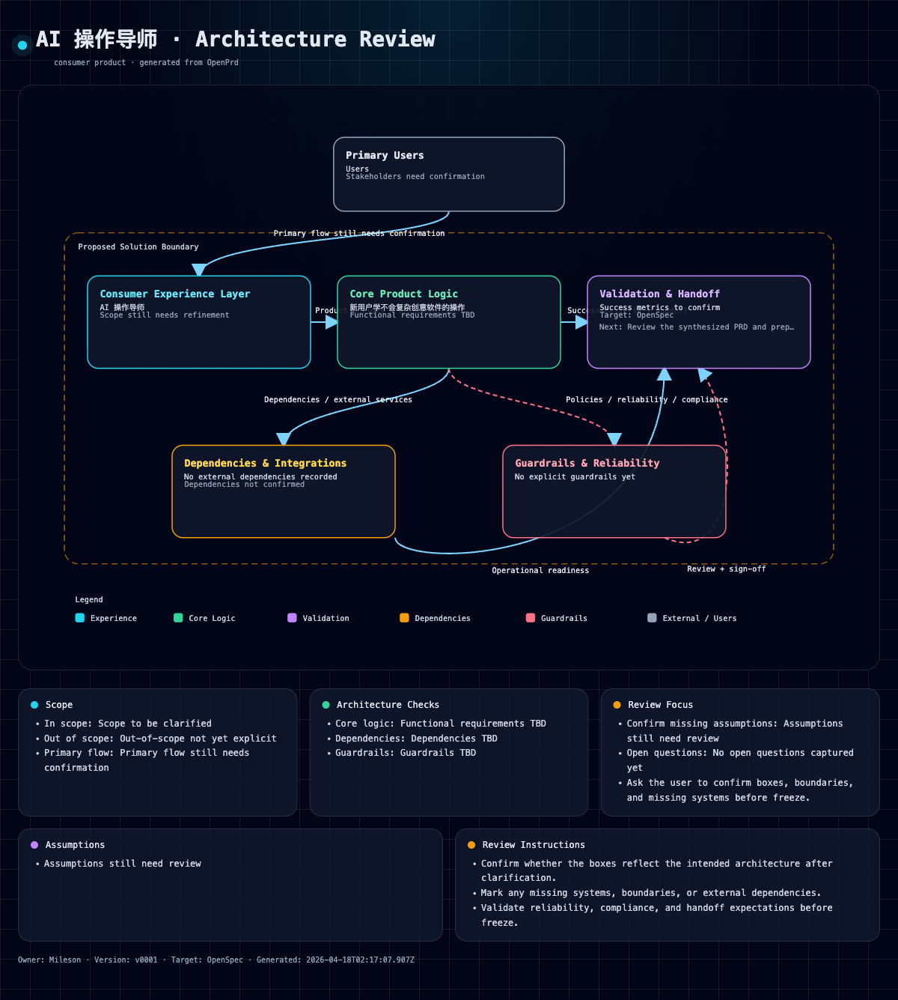

# OpenPrd

English | [简体中文](./README_CN.md)

> 面向需求澄清、评审关卡、图形确认与交接的 AI 原生 PRD 工作区与 CLI。

[](./LICENSE)
[](https://nodejs.org/)
[](https://github.com/mileson/openprd)

OpenPrd 是一个轻量但结构化的 **PRD harness**。它不只是“生成一份文档”，而是帮助团队和 Agent 完成：

- 需求澄清
- 用户确认
- 图形化评审
- 冻结前关卡控制
- 面向执行系统的结构化交接



## 适合什么场景

如果你希望：

- 在写 PRD 前先澄清需求
- 区分用户确认、项目已有事实和 Agent 推断
- 在 freeze 前插入架构图 / 流程图评审
- 让 Agent 遵循 repo 内置的协同规则

那么 OpenPrd 就很适合你。

## 核心能力

- **Clarification-first**：`clarify -> capture -> classify -> interview -> synthesize -> diagram -> freeze -> handoff`
- **场景感知协同**：区分空项目冷启动、已有项目首次接入、持续推进中的 workspace
- **来源感知采集**：支持 `user-confirmed` / `project-derived` / `agent-inferred`
- **图形评审工件**：支持 `architecture` 和 `product-flow`
- **Contract 驱动图渲染**：支持从 JSON contract 显式渲染
- **Review status**：支持 `pending-confirmation` / `confirmed` / `needs-revision`
- **OpenPrd 发现模式**：为已有项目、参考项目或不清晰需求初始化可持续推进的覆盖状态
- **项目标准化**：初始化并验证 `docs/basic/`、文件说明书模板和文件夹 README 模板
- **OpenPrd change 与任务执行**：从 PRD 快照生成 change 文件，校验结构，沉淀 accepted specs，归档变更，并按依赖顺序推进结构化任务
- **长程 Agent Loop**：把 change 任务转成“一次新会话只做一个任务”的 Codex / Claude 执行提示词，并沉淀验证、进度日志和可选任务 commit
- **默认 Agent 接入**：从一套 OpenPrd 源生成 Codex、Claude、Cursor 三端规则，并默认开启 Codex hooks
- **Repo 内置 skills**：工具和 Agent 协同约束一起发布

## 一句话安装

```bash
npm install -g git+https://github.com/mileson/openprd.git
```

安装后验证：

```bash
openprd --help
```

## 快速开始

### 1. 初始化

```bash
openprd init /path/to/project --template-pack agent
```

`init` 会创建 `.openprd/`、`docs/basic/`、`AGENTS.md`，并生成 Codex / Claude / Cursor 三端引导。Codex 项目会同时写入 `.codex/config.toml`、`.codex/hooks.json`、`.codex/hooks/openprd-hook.mjs`，并开启用户级 Codex `codex_hooks = true`。

### 2. 查看当前协同节奏

```bash
openprd status /path/to/project
openprd next /path/to/project
```

### 3. 先向用户澄清

```bash
openprd clarify /path/to/project
```

### 4. 写回答案

单条写回：

```bash
openprd capture /path/to/project \
  --field problem.problemStatement \
  --value "移动端缺少高效的 Agent 会话与节点管理入口" \
  --source user-confirmed
```

批量写回：

```bash
openprd capture /path/to/project --json-file answers.json
```

### 5. 生成草稿与图

```bash
openprd synthesize /path/to/project \
  --title "Moticlaw Mobile" \
  --owner "Moticlaw" \
  --problem "移动端用户缺少直连优先的节点选择与 Agent 会话入口。" \
  --why-now "控制面已经具备，当前缺少的是移动端入口。"

openprd diagram /path/to/project --type architecture --open
openprd diagram /path/to/project --type product-flow --open
```

### 6. Freeze 与 handoff

```bash
openprd freeze /path/to/project
openprd handoff /path/to/project --target openprd
```

### 7. 启动 OpenPrd 发现模式

用户可以直接用自然语言说：

```text
用 OpenPrd 深度补全这个项目。
用 OpenPrd 全面复刻这个参考项目的产品逻辑。
继续深挖这个需求，直到 OpenPrd 覆盖完整。
```

Agent 会在内部完成路由。底层命令是：

```bash
openprd discovery /path/to/project --mode brownfield
openprd discovery /path/to/project --resume
openprd discovery /path/to/project --advance --claim "用户可以从工作台发起会话" --evidence src/app.ts
openprd discovery /path/to/project --verify
openprd change /path/to/project --generate --change <change-id>
openprd change /path/to/project --validate --change <change-id>
openprd standards /path/to/project --verify
openprd tasks /path/to/project --change <change-id>
openprd tasks /path/to/project --change <change-id> --advance --verify --item T001.01
openprd change /path/to/project --apply --change <change-id>
openprd change /path/to/project --archive --change <change-id>
openprd specs /path/to/project
openprd changes /path/to/project
```

持续发现的校验也会检查当前 OpenPrd change 结构、spec delta、`docs/basic/`
标准化文档和长程任务文件。保留 `tasks.md` 作为第一个入口，每个任务文件最多放
25 个实质 checkbox 任务；超过后继续使用 `tasks-002.md`、`tasks-003.md`。
每个非最终任务文件的最后一个 checkbox 应指向下一个任务文件，方便 Agent 按顺序
继续。项目也可以通过 `.openprd/discovery/config.json` 的
`taskSharding.maxItemsPerFile` 使用更细的本地限制。

如果任务需要稳定编号来支撑长程执行，只保留最小元数据：

```md
- [ ] T009.07 Port legacy database import preview
  - deps: T001.14, T007.06
  - done: preview shows counts, conflicts, skipped items, warnings
  - verify: npm run test -- migration
```

`deps` 只在依赖前置任务时填写；`done` 写完成条件；`verify` 写验证命令或审查步骤。

`tasks` 默认列出下一个依赖已满足的任务。`--advance` 会勾选完成任务；
同时传 `--verify` 时，会先运行该任务的 `verify` 命令，通过后再勾选。执行记录
写在任务文件外，避免把 `tasks.md` 元数据变复杂。

## 项目标准化

`openprd init` 会创建项目标准化契约：

- `docs/basic/file-structure.md`
- `docs/basic/app-flow.md`
- `docs/basic/prd.md`
- `docs/basic/frontend-guidelines.md`
- `docs/basic/backend-structure.md`
- `docs/basic/tech-stack.md`
- `.openprd/standards/file-manual-template.md`
- `.openprd/standards/folder-readme-template.md`

检查命令：

```bash
openprd standards /path/to/project --verify
```

OpenPrd 生成的 change 会包含标准化维护任务，change 校验也会检查这套契约。
项目基础文档的唯一标准路径是 `docs/basic/`。

## Agent 自动接入

OpenPrd 会把协同规则装进项目，让用户不需要记住具体 skill、命令或 hook：

```bash
openprd setup /path/to/project
openprd doctor /path/to/project
openprd update /path/to/project
openprd fleet /path/to/projects --dry-run
openprd run /path/to/project --context
openprd run /path/to/project --verify
openprd loop /path/to/project --plan --change <change-id>
openprd loop /path/to/project --run --agent codex --dry-run
```

仅安装 CLI 不会直接改写项目或用户配置。用户在项目里运行 `openprd init` 或
`openprd setup` 时，才会安装完整的 Codex / Claude / Cursor 适配配置。

`setup` 与 `init` 会生成：

- `AGENTS.md` 中的 OpenPrd 管理规则
- `.codex/skills/`、`.codex/prompts/`、`.codex/config.toml`、`.codex/hooks.json` 和 `.codex/hooks/openprd-hook.mjs`
- 用户级 Codex config 的 `features.codex_hooks = true`
- `.claude/skills/`、`.claude/commands/openprd/` 和 `CLAUDE.md`
- `.cursor/rules/openprd.mdc` 和 `.cursor/commands/`
- `.openprd/harness/install-manifest.json`、`hook-state.json`、`events.jsonl` 和 `drift-report.json`

`doctor` 会检查三端引导、Codex hooks 开关、项目标准化和 OpenPrd 工作区验证是否健康。`update` 会从 OpenPrd 的统一源刷新这些生成文件，并保留用户自己已有的 hook 分组。

这套 harness 是有状态的。Hooks 会记录结构化事件、风险决策和漂移检查结果。`freeze`、`handoff`、accepted spec apply/archive、commit、push、release、publish 等高风险动作会先经过 `openprd run . --verify`，覆盖标准化、工作区校验、激活 change 校验和激活 discovery 校验。

`openprd run . --context` 是类似 Ralph 的循环控制面。它会从激活 change 任务、discovery coverage 或普通 OpenPrd 工作流状态里选择下一项可执行单元，并把 hook turn 记录到 `.openprd/harness/iterations.jsonl`。

### 长程 Agent Loop

如果进入真正的开发落地阶段，建议使用 `openprd loop`。它比 `run --context`
更严格：先生成稳定的 feature list，再为每个任务写出单独提示词，启动一个新的
Codex 或 Claude 会话只处理这一个任务，完成后验证、记录进度，并可为该任务生成
独立 commit。

```bash
openprd loop . --init
openprd loop . --plan --change <change-id>
openprd loop . --next
openprd loop . --prompt --agent codex
openprd loop . --run --agent codex --dry-run
openprd loop . --run --agent claude --dry-run
openprd loop . --verify --item T001.01
openprd loop . --finish --item T001.01 --commit --message "Complete T001.01"
```

Loop 状态会沉淀在 `.openprd/harness/`：

- `feature-list.json`：按依赖排序的执行任务列表
- `progress.md`：给人看的进度记录
- `agent-sessions.jsonl`：每次 prompt / run / finish 的结构化事件
- `bootstrap.sh`：每个新会话启动时执行的检查脚本
- `loop-state.json`：当前任务和最近一次 Agent 会话状态
- `loop-prompts/`：生成过的单任务提示词，便于审计和复用

建议先用 `--dry-run`，让 OpenPrd 生成提示词和准确执行命令，但不直接启动 Agent。
`--agent codex` / `--agent claude` 会使用默认 CLI 集成；只有需要接入团队自定义
包装器时，才使用 `--agent-command "<custom command>"`。

历史项目不要手写 shell 循环批量改。使用 `fleet` 先扫描报告；`--update-openprd` 只刷新已经有 `.openprd/` 的项目，只有 agent 配置或普通项目默认保持不变，除非显式用 `--setup-missing` 接管。

## 怎么看 `status` / `next`

### `openprd status`

重点看：

- `Scenario`
- `User participation mode`
- `Current gate`
- `Upcoming gate`

### `openprd next`

重点看：

- `Next action`
- `Current gate`
- `Upcoming gate`
- `Suggested command`
- `Suggested questions`

## 图 Contract

OpenPrd 支持：

- `architecture`
- `product-flow`

也支持从显式 contract 渲染：

```bash
openprd diagram /path/to/project \
  --type product-flow \
  --input ./product-flow-contract.json
```

## Agent Skills

仓库内自带：

- `skills/openprd-shared/`
- `skills/openprd-harness/`
- `skills/openprd-standards/`
- `skills/openprd-diagram-review/`
- `skills/openprd-discovery-loop/`

配合顶层 `AGENTS.md` 使用，可以让 Agent 更稳定地按照 OpenPrd 的协同方式工作。

## 贡献与安全

- 贡献说明：见 [CONTRIBUTING.md](./CONTRIBUTING.md)
- 安全披露：见 [SECURITY.md](./SECURITY.md)

## 许可证

MIT — 见 [LICENSE](./LICENSE)

## 作者

- X: [Mileson07](https://x.com/Mileson07)
- 小红书: [超级峰](https://xhslink.com/m/4LnJ9aB1f97)
- 抖音: [超级峰](https://v.douyin.com/rH645q7trd8/)
